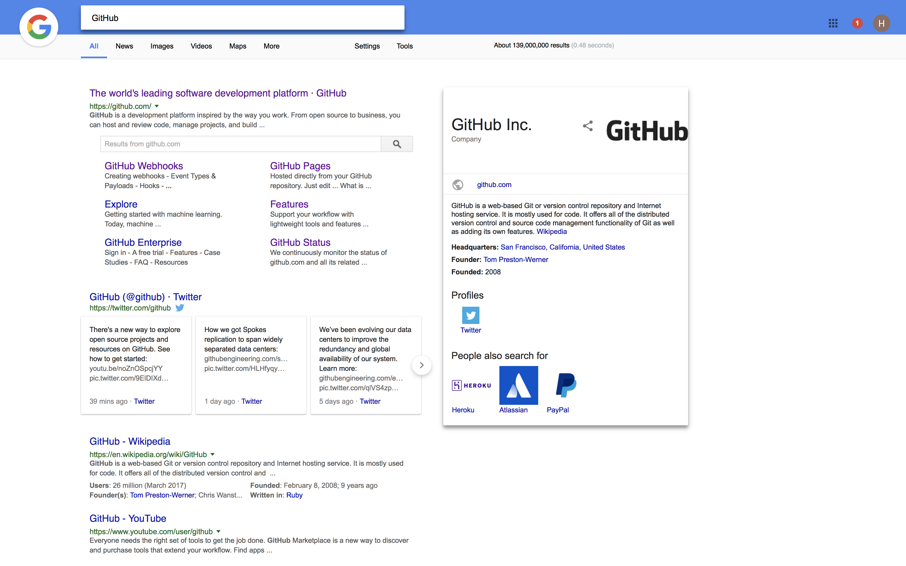

# Stylish CSS

## Google 
Works better with Greasemonkey script [Endless Google](https://openuserjs.org/scripts/tumpio/Endless_Google)
### Screenshot


### Regex
```regex
https*://www.google..*.q=..*
```
